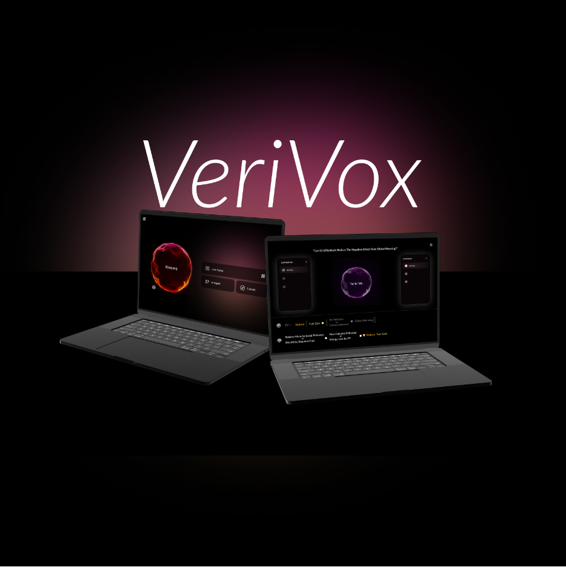

# VeriVox - AI-Powered Debate Platform
<div align="center">
  
</div>
VeriVox is an innovative AI-powered debate platform that combines symbolic logic validation with voice-assisted interaction, creating an immersive and structured learning experience for debate enthusiasts.

## Core Features

### Voice-Oriented Interaction
- 🎙️ **Real-time AI Speech**: Powered by ElevenLabs for natural-sounding AI voice interaction
- 🔊 **Audio Visualization**: Dynamic particle system reflecting voice states and user engagement
- 🗣️ **Voice Recognition**: Seamless speech-to-text processing for natural conversation

### Logic and Reasoning
- ⚡ **Symbolic Logic Engine**: Custom-built validator for argument consistency checking
- 🧠 **AI-Powered Analysis**: Integration with GPT-4o for natural language understanding
- 📚 **Interactive Logic Tutorial**: Learn five fundamental logic symbols (And, Or, Not, If…then, If and only if)

### Social and Gaming Elements
- 🎮 **Multiplayer Mode**: Real-time debate sessions with other users
- 🏆 **Achievement System**: Track progress and earn rewards
- 👥 **Community Features**: Engage with other debaters and share experiences

## Usage & Interface
After logging in, users can choose to start a new debate, interact with the AI agent, or access the tutorial page to learn basic logic symbols.
<div align="center">
  
</div>

In the settings page, users can customize both the voice and role of their AI agent. We're grateful to ElevenLabs for providing a diverse range of natural-sounding voices.
<div align="center">
  
</div>

Once personalization is complete, users can proceed to the tutorial page to learn the basic logic symbols. The tutorial provides examples to help users determine the truth value of different arguments. Users will master five fundamental logic symbols: And, Or, Not, If…then, and If and only if.
<div align="center">
  
</div>

After completing the tutorial, users can begin their debate training with the AI agent. Users select their position in the argument and interact by tapping the central particle ball to start and stop recording their arguments.

The system then displays a clear logical flow diagram of the argument. The AI agent analyzes this structure and responds by typically challenging the premises on the left side of the logic flow. Any logical contradictions are highlighted in yellow.
<div align="center">
  
</div>

## Technology Stack

### Frontend
- **Framework**: React.js
- **State Management**: Redux
- **UI Components**: Custom components with audio-reactive features
- **Audio Processing**: Web Audio API
- **Visualization**: WebGL/Canvas for particle effects

### Backend
- **Core**: Python FastAPI
- **AI Integration**: 
  - OpenAI GPT-4 for natural language processing
  - Custom logic validation engine
- **Voice Processing**:
  - ElevenLabs for text-to-speech
  - Google Cloud Speech-to-Text
- **Real-time Communication**: WebSocket for multiplayer features

### Database & Storage
- Audio file storage system
- User progress and achievement tracking
- Debate session management

## Getting Started

### Prerequisites
- Python 3.9+
- Node.js 14+
- API keys for:
  - OpenAI
  - ElevenLabs
  - Google Cloud

### Installation

1. Clone the repository
```bash
git clone https://github.com/liuxuanzhang718/Hackathon_DebateAI.git
cd Hackathon_DebateAI
```

2. Backend Setup
```bash
# Create and activate virtual environment
python -m venv venv
source venv/bin/activate  # On Windows: venv\Scripts\activate

# Install dependencies
pip install -r requirements.txt

# Configure environment
cp .env.example .env
# Edit .env with your API keys
```

3. Frontend Setup
```bash
cd frontend
npm install
```

### Running the Application

1. Start the backend server
```bash
uvicorn app.main:app --reload
```

2. Start the frontend development server
```bash
cd frontend
npm start
```

## Development Roadmap

### Short-term Goals
- Enhanced voice interaction quality
- Expanded logic symbol library
- Improved multiplayer experience
- Additional achievement types

### Long-term Vision
- Multi-language support
- Advanced AI debate opponents
- Community-driven content creation
- Cross-platform mobile support

## Contributing

We welcome contributions! Please follow these steps:

1. Fork the repository
2. Create your feature branch (`git checkout -b feature/AmazingFeature`)
3. Commit your changes (`git commit -m 'Add some AmazingFeature'`)
4. Push to the branch (`git push origin feature/AmazingFeature`)
5. Open a Pull Request

## License

This project is licensed under the MIT License - see the [LICENSE](LICENSE) file for details.

## Acknowledgments

- OpenAI for GPT-4 API
- ElevenLabs credits and technical support for voice synthesis (Fantastic!)
- Google Cloud for speech recognition
- Our amazing community of contributors and users
- Exciting AI Agent Hackathon 
